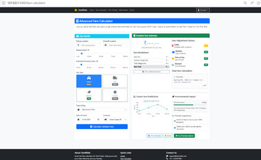

# 🚕 Advanced Fare Calculator - TamiliRide

A feature-rich web application that provides advanced taxi fare estimates across Tamil Nadu. Adjust trip details, fare factors, and see real-time predictions, cost breakdowns, and environmental impact.

## ✨ Features

- 📍 Pickup & Drop Location selection
- 📅 Custom date and time options
- 🚗 Vehicle type selection (Auto, Mini, Sedan, SUV)
- 💸 Dynamic fare adjustment sliders
- 📊 Fare breakdown with detailed charges
- 🔮 Future fare predictions (charts)
- 🌱 Environmental impact analysis
- 🖨️ Print fare estimate
- ✅ Eco-friendly option suggestion

## 🛠️ Tech Stack

- **Frontend:** HTML, CSS (Bootstrap), JavaScript
- **Backend:** Python (Flask)
- **Visualization:** Chart.js
  
